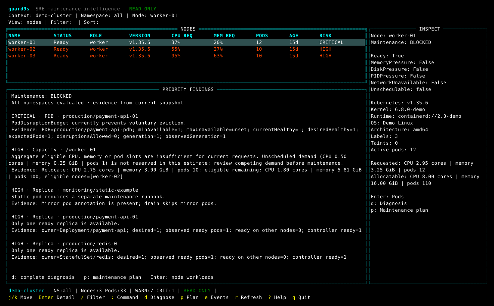

# guard9s

[](https://github.com/hcie123/guard9s/releases/latest)
[](https://github.com/hcie123/guard9s/actions/workflows/ci.yml)
[](LICENSE)
[](go.mod)

[English](#english) | [中文](#中文)

Project / 项目地址: https://github.com/hcie123/guard9s

## English

> **Know what could break before you drain a Kubernetes node.**

guard9s is a **read-only Kubernetes SRE tool** for pre-maintenance node risk
assessment. It checks PDBs, replicas, scheduling constraints, capacity, storage,
Events and missing evidence before you cordon or drain a node.

The maintenance command itself is usually the easy part. The harder part is
deciding whether the node is actually ready to be touched. A PDB may block
eviction, a workload may have only one healthy replica, another node may not have
enough capacity, or some evidence may simply be missing.

guard9s brings those signals together and answers two practical questions:
**“Can I maintain this node now?”** and **“If not, what is stopping me?”**

Its approach is simple: **evidence-driven, read-only and conservative**. Every
finding includes the resource, reason, evidence and a recommendation. If the
evidence is incomplete, guard9s says UNKNOWN instead of quietly assuming safety.



The screenshot is an actual tcell rendering of synthetic data. No real cluster
screenshot or identifier is included.

### Why guard9s?

Before a maintenance window, operators often jump between nodes, pods, PDBs,
replicas, scheduling constraints, storage and Events just to build a mental
picture of one question: “What happens if this node goes away?”

guard9s does not try to replace that judgment. It shortens the evidence-gathering
part. Instead of hiding the decision behind one score, it keeps the underlying
findings visible so an operator can see what is safe, what is risky and what is
still unknown.

### At a glance

| Question | Answer |
| --- | --- |
| Who is it for? | SRE, platform and Kubernetes operators |
| What problem does it solve? | Pre-maintenance node risk assessment with evidence |
| Does it change the cluster? | No. Production behavior is read-only |
| Does it run `cordon` or `drain`? | No. Plans are display-only |
| Does it read Secrets? | No |
| Can I try it without a cluster? | Yes, with `guard9s --demo` |
| Output | Interactive TUI, JSON and Markdown |
| Main evidence | Node/Pod health, PDB, replicas, capacity, scheduling, storage and Events |
| What happens when evidence is missing? | The result stays conservative and reports UNKNOWN |

guard9s deliberately stops before the dangerous part. It does not automate
`drain`, try to replace the Kubernetes scheduler, or promise that an application
will stay available after maintenance. Its job is to help an operator review the
right evidence **before** making the change.

### Installation

#### Prebuilt binary — no Go required

**v0.4.0 is the initial open source release of guard9s.** Download the matching
archive and `checksums.txt` from the
[v0.4.0 GitHub Release](https://github.com/hcie123/guard9s/releases/tag/v0.4.0).
CI `SNAPSHOT` artifacts remain test artifacts; use the formal Release assets for
installation.

Linux amd64 example:

```sh
grep '  guard9s_0.4.0_linux_amd64.tar.gz$' checksums.txt | sha256sum --check -
tar -xzf guard9s_0.4.0_linux_amd64.tar.gz
./guard9s --version
./guard9s --help
```

Optional installation into PATH:

```sh
sudo install -m 0755 guard9s /usr/local/bin/guard9s
guard9s --version
guard9s --help
```

Builds cover **Linux, macOS and Windows × amd64/arm64**; Windows uses ZIP and the
others use tar.gz. Running the binary does not require Go. The manual v1.36.4
validation used a Linux amd64 CI archive on a machine without Go.

#### Build from source

To build from source, use **Go 1.26+**, as declared in [go.mod](go.mod). Run the
build from the cloned repository root:

```sh
git clone https://github.com/hcie123/guard9s.git
cd guard9s
make build
./bin/guard9s --demo
```

Without Make: `CGO_ENABLED=0 go build -trimpath -o guard9s ./cmd/guard9s`.
Source builds may show `dev (commit unknown)`; GoReleaser snapshots embed their
snapshot version and commit.

### Quick start

Commands below assume installation into PATH. Otherwise use `./guard9s` for an
unpacked archive or `./bin/guard9s` for a source build.

Start offline; demo mode never loads kubeconfig or connects to an API:

```sh
guard9s --demo
guard9s --demo --demo-scenario healthy
guard9s --demo --demo-scenario scheduling
```

The default mixed scenario has 3 nodes/33 pods; healthy and scheduling each have
27 pods. Use a terminal around 120 columns wide for comfortable inspection.

### Five-minute TUI tour

If this is your first run, start with the synthetic demo. You can understand the
basic workflow in a few minutes:

1. Run `guard9s --demo`.
2. Use `j` / `k` (or arrow keys) to select a node and read the maintenance result.
3. Press `Enter` to inspect workloads; use `d` for full diagnosis and `p` for the display-only maintenance plan.
4. Try `:pdb`, `:storage`, `:capacity` and `:risks` to inspect the evidence behind the result.
5. Use `/` to filter, `Esc` to go back, `?` for help and `q` to quit.

A typical investigation is:

```text
Node
  ↓
Maintenance result
  ↓
Priority findings
  ↓
Pod / PDB / Replica / Storage / Scheduling evidence
  ↓
Diagnosis
  ↓
Display-only maintenance plan
```

The final READY/BLOCKED label is only the summary. The useful part is the evidence
behind it: **why** the result was reached, which workload caused it, and what is
still UNKNOWN.

For an explicitly approved test cluster, replace the example context and worker
names. Select a node inside the TUI:

```sh
guard9s --context my-context
```

Export JSON, basic-redacted JSON or Markdown:

```sh
guard9s --context my-context --node worker-01 --output json
guard9s --context my-context --node worker-01 --output json --redact=basic
guard9s --context my-context --node worker-01 --output markdown
```

**`--node` is only accepted with `--output json` or `--output markdown`.** Do not
add it to the TUI command. Report exit code 0 means export succeeded, including
BLOCKED reports; inspect `readiness` before making decisions.

Kubeconfig loading follows client-go conventions, including `KUBECONFIG` and
`--kubeconfig`. Use trusted credentials with the read permissions in
[deploy/rbac.yaml](deploy/rbac.yaml). `--namespace` filters display only;
collection and diagnosis always cover **all namespaces**.

### What it checks

| Area | Evidence |
| --- | --- |
| Node / Pod health | Ready and pressure conditions, scheduling state, crash loops, OOM history, restarts and relevant warning events |
| PDB / replicas | Selectors, allowance, stale status, overlaps, unhealthy or colocated replicas and built-in controller ownership |
| Capacity / scheduling | CPU/memory requests and pod slots; required affinity/anti-affinity, NamespaceSelector and hard topology spread; ALLOWED / REJECTED / UNKNOWN candidates |
| Storage | PVC/PV lifecycle and affinity, local storage, StorageClass, optional CSINode and observed VolumeAttachment evidence |
| Diagnosis / reports | Maintenance readiness, display-only plan, JSON `guard9s/v1`, Markdown and deterministic basic redaction |

| Readiness | Meaning |
| --- | --- |
| READY | No warning, high, critical or unknown finding |
| READY WITH WARNINGS | Warnings, without high, critical or unknown findings |
| NOT RECOMMENDED | High or unknown evidence |
| BLOCKED | A critical finding |

Severity is PASS / INFO / WARN / HIGH / CRITICAL. UNKNOWN is an uncertainty marker,
not another severity. Capacity uses requests, not live CPU or memory utilization.

### TUI and reports

Use `:nodes`, `:pods`, `:risks`, `:events`, `:capacity`, `:pdb`, `:storage`,
`:diagnosis`, `:plan` and `:help` to switch views.

| Keys | Action |
| --- | --- |
| Arrows or `j` / `k`; `Enter`; `Esc` | Move, inspect, go back |
| `/`; `s`; `:` | Filter, cycle sorting, open commands |
| `d`; `p`; `r`; `Tab` | Diagnosis, plan, refresh cache, change focus |
| `?`; `q` / `Ctrl+C` | Help; quit (`q` first closes an open detail) |

Filters combine with AND, for example `namespace:demo status:Running` or
`risk>=HIGH category:Storage`; `:` matches substrings and `=` exact values.
Refresh preserves selection and replaces stale evidence; failed collection stays
UNKNOWN. Plans are text suggestions and never execute commands.

JSON includes schema, snapshot time, readOnly, readiness, findings, capabilities,
scheduling candidates and structured quantities. `--redact=basic` assigns stable,
type-aware aliases for the same snapshot while preserving severity, UNKNOWN,
status and quantities. It is **not complete anonymization**: arbitrary business
or Event prose still needs review. Redacted commands contain placeholders and
must not be executed verbatim. Protect reports, recordings and screenshots.

### Safety and compatibility

Production Kubernetes traffic passes a **GET-only transport and explicit resource
allowlist**. RBAC grants only get/list/watch. Secret access, writes, exec, logs,
port-forward and eviction are blocked. There is no shell execution, automatic
maintenance, telemetry, phone-home, remote upload or AI API integration.
Credential exec/auth-provider plugins and insecure TLS are unsupported.

> **Maintenance guidance, not a safety guarantee.** guard9s evaluates the evidence
> available in the current snapshot. A `READY` result does not guarantee that
> eviction, rescheduling, storage transitions or application behavior will be safe.
> Always validate critical workloads and environment-specific runbooks before maintenance.

| Validation class | Kubernetes | Scope |
| --- | --- | --- |
| CI integration | v1.34.11, v1.35.8 | Disposable three-node kind clusters, separate read-only identity |
| Manual test environment | v1.36.4 | 2026-10-05; Linux amd64 CI binary without Go; TUI, JSON and basic redaction |

The manual sample contained 23 nodes/183 pods and retained NOT RECOMMENDED for
the selected worker. These are specific validation records, **not guaranteed
support for every Kubernetes 1.34–1.36 release or production environment**.
Client libraries remain pinned to v0.35.6; compatibility elsewhere is not guaranteed.

Known limitations:

- Third-party CRD controllers such as **StrimziPodSet** may have incomplete owner
  chains. guard9s returns **UNKNOWN / incomplete evidence**, not assumed safety.
- Snapshots are not cross-resource transactions. Scheduler profiles, interacting
  replacements, CSI backend health and future attach/detach remain outside the model.
- CSINode and VolumeAttachment are optional; failed collection differs from empty
  inventory. Zero VolumeAttachments does not prove storage-backend safety.
- Findings currently have no `code` field. Long text can wrap in narrow terminals.

### How it works

At a high level, guard9s keeps collection and analysis separate:

```text
Kubernetes API or offline demo
        ↓
read-only collection
        ↓
indexed snapshot
        ↓
Node / PDB / Replica / Storage / Scheduling / Capacity / Pod / Event analyzers
        ↓
findings + relocation candidates + capacity evidence
        ↓
maintenance readiness
        ↓
TUI / JSON / Markdown
```

The analyzer layer does not use a Kubernetes client or shell. It evaluates an
already collected snapshot, which keeps evidence analysis deterministic and easier
to test. Missing or failed evidence is carried forward as UNKNOWN instead of being
silently treated as safe.

### Development and documentation

Run `make check` for format, vet, unit, race, the **90% core coverage gate**, build
and the default-off live-test guard. Real kind integration uses separate disposable
clusters; `make live-test` stays opt-in with explicit test kubeconfig/context/node.

[Validation](docs/verification.md) · [Compatibility](docs/compatibility.md) ·
[Analysis limits](docs/analysis.md) · [Live-test guide](docs/live-testing.md) ·
[Performance](docs/performance.md) · [Security](SECURITY.md) ·
[Release notes](CHANGELOG.md) · [Contributing](CONTRIBUTING.md) ·
[Code of conduct](CODE_OF_CONDUCT.md)

guard9s is licensed under Apache License 2.0. See [LICENSE](LICENSE).

## 中文

> **在 drain 一个 Kubernetes 节点之前，先知道什么可能出问题。**

guard9s 是一个**只读的 Kubernetes SRE 节点维护风险检查工具**。

它会在 cordon / drain 之前检查 PDB、副本、调度约束、容量、存储、Events
以及缺失证据，帮助你判断节点当前是否适合维护。

节点维护本身通常就是几条命令，真正难的是动手之前的判断：
**这个节点现在到底能不能动？**

PDB 会不会卡住驱逐？是不是只有一个健康副本？剩余节点能不能接住这些 Pod？
存储和调度约束有没有问题？如果有些关键证据压根没采集到，还该不该继续？

guard9s 做的事情很直接：把这些分散的信息收拢到一起，给出维护结论，
同时把 **“为什么”** 展示出来，而不是只丢给你一个红灯或绿灯。

它遵循三个原则：**看证据、只读、保守判断**。每条风险都会带上资源、原因、
证据和建议；如果证据不完整，就保留为 UNKNOWN，而不是因为“没查到”就当成安全。

上方截图全部来自合成 Demo 数据，不包含真实集群截图或真实环境标识。

### 为什么做 guard9s？

实际做节点维护时，经常要在 Node、Pod、PDB、副本、调度约束、容量、存储和 Events
之间来回确认，最后才能拼出一个答案：“如果这个节点现在下线，会发生什么？”

guard9s 不替人做这个决定，也不试图把复杂问题压成一个神秘分数。它只是把
**收集证据这一步变得更集中**：哪些地方没问题、哪些地方有风险、哪些地方证据不足，
都尽量摆在明面上，让运维人员自己做最后判断。

### 一眼看懂

| 问题 | 答案 |
| --- | --- |
| 适合谁？ | SRE、平台工程师和 Kubernetes 运维人员 |
| 解决什么问题？ | 节点维护前的风险评估，并给出证据 |
| 会修改集群吗？ | 不会，生产路径只读 |
| 会自动执行 `cordon` / `drain` 吗？ | 不会，维护计划只展示 |
| 会读取 Secret 吗？ | 不会 |
| 没有 Kubernetes 集群能体验吗？ | 可以，直接运行 `guard9s --demo` |
| 输出形式 | TUI、JSON、Markdown |
| 主要检查什么？ | Node/Pod 健康、PDB、副本、容量、调度、存储、Events |
| 证据不足怎么办？ | 保守返回 UNKNOWN，不会因为“没查到”就默认安全 |

guard9s 会刻意停在“真正动集群”之前：它不会替你执行 `drain`，不会假装自己是
完整的 Kubernetes Scheduler，也不会承诺维护后业务一定没问题。它只负责把
**维护前值得看的证据**整理清楚，让人来做最后决定。

### 安装

#### 预编译二进制：运行不需要 Go

**v0.4.0 是 guard9s 的首次正式开源版本。** 请从
[v0.4.0 GitHub Release](https://github.com/hcie123/guard9s/releases/tag/v0.4.0)
下载对应平台的归档和 `checksums.txt`。CI 里的 `SNAPSHOT` 仍然只是测试产物，
正式安装请使用 Release 资产。

Linux amd64 示例：

```sh
grep '  guard9s_0.4.0_linux_amd64.tar.gz$' checksums.txt | sha256sum --check -
tar -xzf guard9s_0.4.0_linux_amd64.tar.gz
./guard9s --version
./guard9s --help
```

可选安装到 PATH：

```sh
sudo install -m 0755 guard9s /usr/local/bin/guard9s
guard9s --version
guard9s --help
```

构建覆盖 **Linux、macOS、Windows 的 amd64/arm64**；Windows 使用 ZIP，
其余使用 tar.gz。运行预编译文件不需要 Go。v1.36.4 人工验收已在没有 Go 的
Linux amd64 测试机上直接运行 CI 归档。

#### 从源码构建

如果从源码构建，按 [go.mod](go.mod) 使用 **Go 1.26+**。
在克隆后的仓库根目录构建：

```sh
git clone https://github.com/hcie123/guard9s.git
cd guard9s
make build
./bin/guard9s --demo
```

没有 Make 时：`CGO_ENABLED=0 go build -trimpath -o guard9s ./cmd/guard9s`。
源码构建可能显示 `dev (commit unknown)`；GoReleaser snapshot 会写入快照版本和提交号。

### 快速开始

以下假设已安装到 PATH；解压运行时用 `./guard9s`，源码构建时用 `./bin/guard9s`。
先运行离线 Demo，它不会读取 kubeconfig 或连接 API：

```sh
guard9s --demo
guard9s --demo --demo-scenario healthy
guard9s --demo --demo-scenario scheduling
```

默认 mixed 场景有 3 个节点、33 个 Pod；healthy 和 scheduling 各有 27 个 Pod。
建议使用约 120 列宽的终端。

### 5 分钟上手 TUI

第一次用的时候，不用急着连真实集群。先跑一遍合成 Demo，几分钟就能把基本操作摸清：

1. 运行 `guard9s --demo`。
2. 用 `j` / `k`（或方向键）选择 Node，先看维护结论。
3. 按 `Enter` 下钻到 workload；按 `d` 看完整诊断，按 `p` 看只展示、不执行的维护计划。
4. 依次试试 `:pdb`、`:storage`、`:capacity`、`:risks`，理解结论背后的证据。
5. 用 `/` 过滤，`Esc` 返回，`?` 查看帮助，`q` 退出。

一次典型排查可以理解成：

```text
Node
  ↓
维护结论
  ↓
优先风险
  ↓
Pod / PDB / 副本 / 存储 / 调度证据
  ↓
完整诊断
  ↓
只展示的维护计划
```

READY / BLOCKED 只是最后一行结论。更值得看的是它后面的证据：**为什么会得到这个结果、
具体卡在哪个 workload、还有哪些信息处于 UNKNOWN。**

连接明确获准的测试集群时，替换示例 context 和节点名。在 TUI 内选择节点：

```sh
guard9s --context my-context
```

导出 JSON、基础脱敏 JSON 或 Markdown：

```sh
guard9s --context my-context --node worker-01 --output json
guard9s --context my-context --node worker-01 --output json --redact=basic
guard9s --context my-context --node worker-01 --output markdown
```

**TUI 不允许加 `--node`；该参数仅用于 `--output json` 或 `--output markdown`。**
退出码 0 只表示导出成功，BLOCKED 报告也会成功导出；决策时必须检查 `readiness`。

配置遵循 client-go 的 `KUBECONFIG` / `--kubeconfig` 规则。使用可信凭据和
[只读权限](deploy/rbac.yaml)。`--namespace` 只过滤展示，采集与诊断始终覆盖**全部 Namespace**。

### 它会看哪些证据

| 范围 | 证据 |
| --- | --- |
| Node / Pod 健康 | Ready、压力、调度状态、崩溃循环、OOM 历史、重启与相关警告事件 |
| PDB / 副本 | 选择器、中断额度、状态过期、重叠预算、健康副本与同节点集中、内置 controller owner chain |
| 容量 / 调度 | CPU/内存 requests、Pod 槽位；必需亲和/反亲和、NamespaceSelector、硬 TopologySpread；ALLOWED / REJECTED / UNKNOWN 候选 |
| 存储 | PVC/PV 生命周期与亲和、本地存储、StorageClass、可选 CSINode 和已观察到的 VolumeAttachment |
| 诊断 / 报告 | 维护结论、仅展示的计划、JSON `guard9s/v1`、Markdown 与确定性基础脱敏 |

| 维护结论 | 含义 |
| --- | --- |
| READY | 没有 WARN、HIGH、CRITICAL 或 UNKNOWN |
| READY WITH WARNINGS | 有 WARN，但没有 HIGH、CRITICAL 或 UNKNOWN |
| NOT RECOMMENDED | 有 HIGH 或 UNKNOWN |
| BLOCKED | 有 CRITICAL |

严重级别为 PASS / INFO / WARN / HIGH / CRITICAL；UNKNOWN 是不确定性标记。
容量基于 requests，不是实时 CPU、内存利用率。

### TUI 怎么用

可用视图：`:nodes`、`:pods`、`:risks`、`:events`、`:capacity`、`:pdb`、`:storage`、
`:diagnosis`、`:plan`、`:help`。

| 按键 | 操作 |
| --- | --- |
| 方向键或 `j` / `k`；`Enter`；`Esc` | 移动、查看详情、返回 |
| `/`；`s`；`:` | 过滤、切换排序、输入命令 |
| `d`；`p`；`r`；`Tab` | 诊断、计划、刷新缓存、切换焦点 |
| `?`；`q` / `Ctrl+C` | 帮助；退出（详情页中 `q` 先关闭详情） |

过滤条件以 AND 组合，例如 `namespace:demo status:Running`、`risk>=HIGH category:Storage`。
`:` 表示子串，`=` 表示精确匹配。刷新保留选择并更新证据；采集失败保留 UNKNOWN。
维护计划只展示建议，不执行命令。

JSON 包含 schema、快照时间、readOnly、readiness、findings、capabilities、调度候选和结构化数量。
`--redact=basic` 对同一快照生成稳定、区分资源类型的别名，保持严重度、UNKNOWN、状态和数量。
它**不等于完全匿名化**，任意业务文字和 Event 内容仍需检查。脱敏命令包含占位符，
不能直接执行；请保护报告、录屏与截图。

### 安全边界与兼容性

生产请求经过 **GET-only transport 和明确的资源路径白名单**，RBAC 仅 get/list/watch。
禁止读取 Secret、写操作、exec、logs、port-forward、eviction；没有 shell 执行、自动维护、
telemetry、phone-home、远程上传或 AI API。拒绝认证 exec/auth-provider 插件与跳过 TLS 校验。

> **这里的结论是维护建议，不是安全保证。** guard9s 只能根据当前快照里能看到的证据做判断。
> 即使显示 `READY`，也不代表驱逐、重新调度、存储切换或应用行为一定没有风险。
> 对关键业务动手前，仍然要结合实际环境、业务冗余和自己的运维流程再确认一次。

| 验证类型 | Kubernetes | 范围 |
| --- | --- | --- |
| CI 集成 | v1.34.11、v1.35.8 | 一次性三节点 kind，独立只读身份 |
| 人工测试环境 | v1.36.4 | 2026-10-05；无 Go 的 Linux amd64 机器运行 CI 二进制；TUI、JSON、基础脱敏 |

人工样本有 23 个节点、183 个 Pod，所选节点的结论保持 NOT RECOMMENDED。
这些是特定验证记录，**不保证 Kubernetes 1.34–1.36 全系列或生产环境兼容性**。
客户端依赖固定为 v0.35.6，未测试环境不作保证。

已知限制：

- **StrimziPodSet** 等第三方 CRD controller 的 owner chain 可能不完整，
  此时保守返回 **UNKNOWN / incomplete evidence**，不会默认为维护安全。
- 快照不是跨资源事务；调度器配置、多个替换 Pod 的相互影响、CSI 后端健康和未来挂载转换不在模型保证范围。
- CSINode、VolumeAttachment 是可选证据；采集失败与空结果不同，0 个 VolumeAttachment 不证明后端安全。
- finding 当前没有 `code` 字段；窄终端中的长文字可能换行。

### 工作原理

如果不看 Go 代码，可以把 guard9s 理解成下面这条流水线：

```text
Kubernetes API 或离线 Demo
        ↓
只读采集
        ↓
建立 Snapshot 索引
        ↓
Node / PDB / 副本 / 存储 / 调度 / 容量 / Pod / Event 分析
        ↓
Finding + 可迁移候选 + 容量证据
        ↓
维护结论
        ↓
TUI / JSON / Markdown
```

采集和分析是分开的。分析层不直接调用 Kubernetes Client，也不会执行 shell，
它只处理已经采集好的 Snapshot。这样做有两个好处：同一份证据更容易得到稳定结果，
也更方便测试。遇到采集失败或证据缺失时，结果会明确保留为 UNKNOWN，
不会把“没看到”误当成“没有风险”。

### 开发与文档

`make check` 执行格式、vet、unit、race、**90% 核心覆盖率门槛**、构建和默认关闭的 live-test 防护检查。
真实 kind 集成使用独立的一次性集群；`make live-test` 仍需显式启用并指定测试 kubeconfig/context/node。

[验证记录](docs/verification.md) · [兼容性](docs/compatibility.md) ·
[分析边界](docs/analysis.md) · [人工验收指南](docs/live-testing.md) ·
[性能](docs/performance.md) · [安全](SECURITY.md) · [发布说明](CHANGELOG.md) ·
[贡献指南](CONTRIBUTING.md) · [行为准则](CODE_OF_CONDUCT.md)

guard9s 使用 Apache License 2.0 开源许可证。详见 [LICENSE](LICENSE)。
